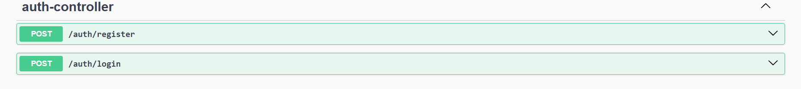
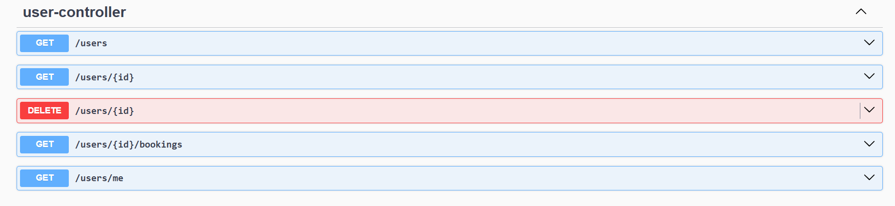
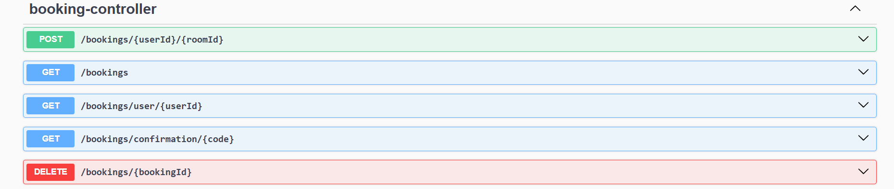
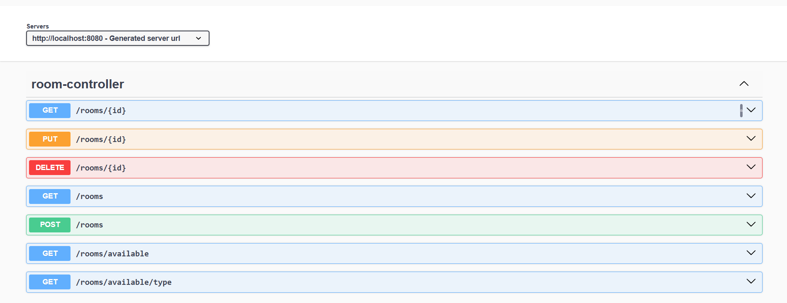
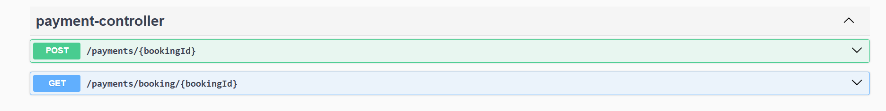

# 🏨 CodeAlpha - Hotel Reservation System

A full backend Hotel Reservation System built using **Spring Boot**, **JWT Authentication**, **MySQL**, and **Cloudinary** for image storage.

This project was developed as part of the **CodeAlpha Java Programming Internship**.

---

## 🚀 Tech Stack

- Java 21
- Spring Boot
- Spring Security (JWT)
- Spring Data JPA
- MySQL
- Cloudinary (Image Upload)
- Swagger (OpenAPI)
- Maven

---

## 🔐 Authentication & Authorization

- JWT-based Authentication
- Role-Based Access Control
    - ROLE_ADMIN
    - ROLE_USER

---

## 📌 Features

- User Registration & Login
- Role-Based Access
- Room Categorization (STANDARD, DELUXE, SUITE)
- Room Availability Search
- Booking System
- Booking Cancellation
- Payment Simulation
- Cloudinary Image Upload
- Swagger API Documentation

---

# 📚 API Documentation (Swagger UI)

Swagger is available at:
http://localhost:8080/swagger-ui/index.html#

---

# 📷 API Screenshots

---

## 🔐 Auth Controller

Handles user registration and login.

---

## 👤 User Controller

Admin user management and user profile endpoints.

---

## 📅 Booking Controller

Create, cancel, and view bookings.

---

## 🏨 Room Controller

Manage rooms and search available rooms.

---

## 💳 Payment Controller

Simulated payment processing.

---

# 🗂️ Project Structure

CodeAlpha_HotelReservationSystem
│
├── src

│ ├── controller

│ ├── service

│ ├── repository

│ ├── entity

│ ├── dto

│ ├── security

│ └── config

│
├── template (Swagger screenshots)

├── pom.xml

└── README.md

---

# 🛠️ How To Run

1. Clone the repository

git clone https://github.com/yourusername/codealpha_tasks.git

2. Navigate to project folder

cd CodeAlpha_HotelReservationSystem

3. Configure MySQL in `application.properties`

spring.datasource.url=jdbc:mysql://localhost:3306/hotel_booking_db

spring.datasource.username=YOUR_DB_USERNAME

spring.datasource.password=YOUR_DB_PASSWORD

4. Run the application

mvn spring-boot:run

5. Open Swagger

http://localhost:8080/swagger-ui/index.html#

---

# 🧠 System Design Highlights

- Clean layered architecture
- DTO separation
- Custom exception handling
- Secure password encryption
- Stateless session management
- RESTful API design
- Production-ready backend structure

---

# 📜 Internship Submission

This project is submitted for:

**CodeAlpha Java Programming Internship — Task 2 (Hotel Reservation System)**

---

# 👨‍💻 Developed By

Samprit Roy  
Java Backend Developer

